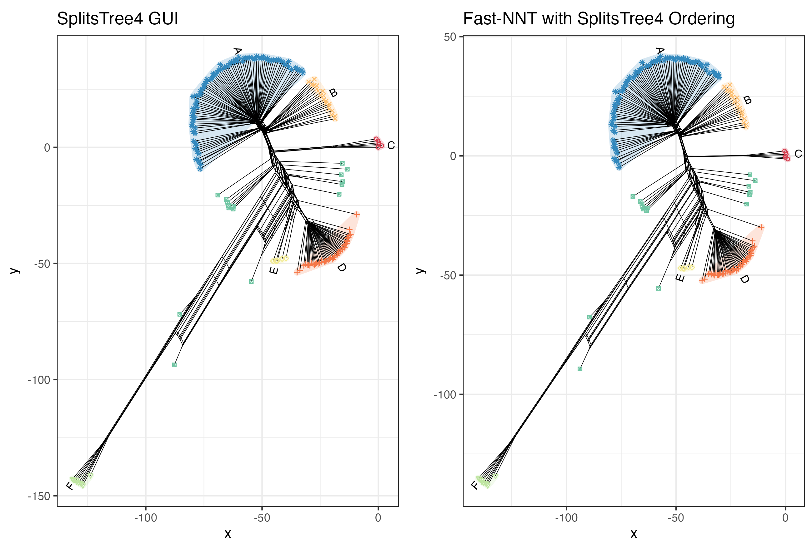

# anon-nnt
anon-nnt is a simple Rust implementation of the Neighbour Net algorithm with both R and Python bindings.

### Introduction

anon-nnt is a Rust implementation of the NeighbourNet algorithm, designed for efficient phylogenetic analysis. It constructs split trees from distance matrices, providing a fast and reliable tool for researchers in evolutionary biology. R and Python bindings are provided so that users can easily integrate anon-nnt into their existing workflows.

**Why does this exist when SplitsTree is available?**

Well, SplitsTree4/6 are GUI-based applications, while anon-nnt is a command-line tool that can be easily integrated into automated workflows and pipelines. It's meant to be lightweight and simple to use, you provide a simple input and it generates the nexus file. You can then use this file in R or Python to generate your own plots. This is perfect for people who love to manually beautify their visualizations.

Additionally, we provide R and Python bindings that allow you pass in memory data matrices directly with a single command and get results without having to write intermediate files. For installation instructions, please refer to the respective documentation for R and Python.

**How do the results compare to SplitsTree?**

anon-nnt aims to produce results that are consistent with those generated by SplitsTree, but there may be differences due to the underlying implementations and algorithms used. Users are encouraged to compare the output from anon-nnt with that of SplitsTree to assess any discrepancies and determine the best tool for their specific needs.



### Installation
Install Rust via rustup.

#### Python
Install the Python package from a local checkout:
```bash
cd anon-nnt-py
pip install .
```

#### R
Install the R package from a local checkout:
```R
devtools::install_local("anonnntr")
```

If you are developing locally and have changed the R bindings:
```R
rextendr::document()
devtools::load_all()
```

#### CLI

Build from source from a local checkout:
```bash
cargo install --path .
anon_nnt --help # or anon_nnt --help
```

### Usage

For `Python` and `R`, complete usage examples can be found in `test/python` and `test/r`. But a brief summary is as follows.

#### Ordering and inference methods
Anon-NNT exposes two knobs that match the algorithmic choices in SplitsTree:
- Ordering (`ordering_method` / `-O`): the cycle construction step. Options are `splitstree4` (SplitsTree4-style ordering) and `huson2023` (the improved ordering from Bryant & Huson 2023).
- Inference (`inference_method` / `--inference`): the split-weight solver. Options are `active-set` (active-set NNLS, default) and `splitstree4` (SplitsTree4-style optimizer).
- For SplitsTree6-style defaults, use `ordering_method="splitstree4"` with `inference_method="active-set"` (or `-O splitstree4 --inference active-set` in the CLI).
- For SplitsTree4-style defaults, use `ordering_method="splitstree4"` with `inference_method="splitstree4"` (or `-O splitstree4 --inference splitstree4` in the CLI).

#### Python
Set the thread count once per session:
```
import anon_nntpy as fn
fn.set_anon_nnt_threads(4)
```

Read data in via `numpy`, `pandas`, or `polars`:

```
import anon_nntpy as fn
import pandas as pd
data = pd.read_csv("test/data/large/large_dist_matrix.csv")
n = fn.run_neighbour_net(
    data,
    ordering_method="huson2023",
    inference_method="active-set",
)
print("Labels")
print(len(n.get_labels()))
print("Splits Records")
print(len(n.get_splits_records()))
print("Node Translations")
print(len(n.get_node_translations()))
print("Node Positions")
print(len(n.get_node_positions()))
print("Graph Edges")
print(len(n.get_graph_edges()))
```

#### R
Set the thread count once per session:
```
library(anonnntr)
anonnntr::set_anon_nnt_threads(4)
```

Read your distance matrix in using your preferred method (e.g., `data.table`):
```
library(anonnntr)
library(data.table)
data <- fread("test/data/large/large_dist_matrix.csv", header=TRUE)
# Load network
Nnet <- anonnntr::run_neighbournet_networkx(
  data,
  ordering_method="huson2023",
  inference_method="active-set"
)
```

The `run_neighbournet_networkx` function will return an object almost identical to that produced by `phangorn`, so should be compatible with existing workflows.

#### CLI
Required input is a symmetrical distance matrix, ideally with a header row indicating the taxa labels. Can be separated by any delimiter.

To generate a split nexus file (mostly) identical to SplitsTree4 and SplitsTree6:
```
anon_nnt neighbour_net -t 4 -i test/data/large_dist_matrix.csv -d output_dir -o prefix -O splitstree4
```

Use the new Huson 2023 ordering algorithm (default):
```
anon_nnt neighbour_net -t 4 -i test/data/large_dist_matrix.csv -d output_dir -o prefix -O huson2023
```

Select the split-weight inference method:
```
anon_nnt neighbour_net -t 4 -i test/data/large_dist_matrix.csv -d output_dir -o prefix --inference active-set
anon_nnt neighbour_net -t 4 -i test/data/large_dist_matrix.csv -d output_dir -o prefix --inference splitstree4
```

### Output

The output will include a nexus file containing the split network and network layout.


### Citations

If you use this tool in your work, please cite the original authors work:
- Bryant & Huson 2023: D. Bryant and DH Huson, NeighborNet- improved algorithms and implementation. Front. Bioinform. 3, 2023.
- Bryant & Moulton 2004: D. Bryant and V. Moulton. Neighbor-net: An agglomerative method for the construction of phylogenetic networks. Molecular Biology and Evolution, 21(2):255– 265, 2004.

You can also cite this repository directly as an anonymous software artifact.
