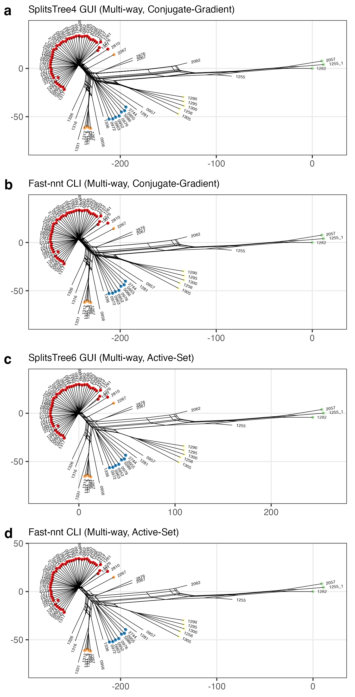
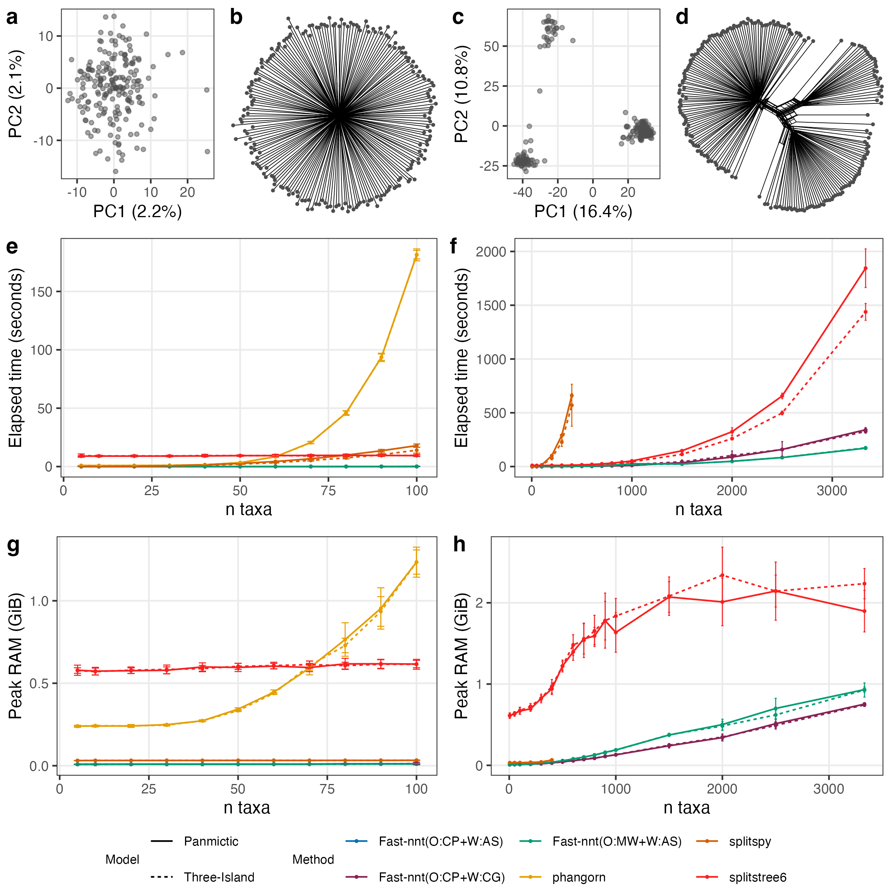
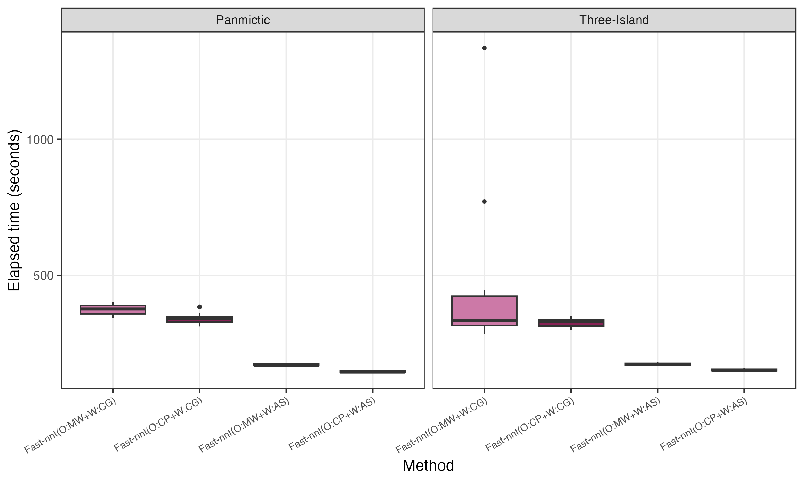

[](https://doi.org/10.5281/zenodo.16907379)

# fast-nnt
fast-nnt (read Fast Ent) is a simple Rust implementation of the Neighbour Net algorithm with both R and Python bindings.

### Introduction

Fast-NNT is a Rust implementation of the NeighbourNet algorithm, designed for efficient phylogenetic analysis. It constructs split trees from distance matrices, providing a fast and reliable tool for researchers in evolutionary biology. R and Python bindings are provided so that users can easily integrate Fast-NNT into their existing workflows.

**Why does this exist when SplitsTree is available?**

Well, SplitsTree4/6 are GUI-based applications, while Fast-NNT is a command-line tool that can be easily integrated into automated workflows and pipelines. It's meant to be lightweight and simple to use, you provide a simple input and it generates the nexus file. You can then use this file in R or Python to generate your own plots. This is perfect for people who love to manually beautify their visualizations.

Additionally, we provide R and Python bindings that allow you pass in memory data matrices directly with a single command and get results without having to write intermediate files. For installation instructions, please refer to the respective documentation for R and Python.

**How do the results compare to SplitsTree?**

Fast-NNT aims to produce results that are consistent with those generated by SplitsTree, but there may be differences due to the underlying implementations and algorithms used. Users are encouraged to compare the output from Fast-NNT with that of SplitsTree to assess any discrepancies and determine the best tool for their specific needs.


*Comparison of network outputs between SplitsTree4 GUI, SplitsTree6 GUI, and fastnnt CLI using multi-way ordering with conjugate-gradient and active-set inference.*


*Performance benchmarks comparing fast-nnt, phangorn, splitspy, and splitstree6 across panmictic and three-island population models. Panels show PCA of input data (a–d), elapsed time (e–f), and peak RAM usage (g–h).*

### Installation
Install Rust via [rustup](https://rustup.rs/).

#### Python
You can install the Python package via pip:
```bash
pip install fastnntpy
```

#### R
You can install the R package via:
```R
install.packages("fastnntr")

# Or if CRAN is unavailable and you have Rust on your machine, i think this will work
devtools::install_github("rhysnewell/fast-nnt", subdir = "fastnntr")
```

If you are developing locally and have changed the R bindings:
```R
rextendr::document()
devtools::load_all()
```

#### CLI

```bash
cargo install fast-nnt
fast_nnt --help # or fastnnt --help
```

Alternatively, you can build from source. Clone and install this repo via:
```bash
git clone https://github.com/rhysnewell/fast-nnt.git
cd fast-nnt
cargo install --path .
fast_nnt --help # or fastnnt --help
```

### Usage

For `Python` and `R`, complete usage examples can be found in `test/python` and `test/R`. But a brief summary is as follows.

#### Ordering and inference methods
Fast-NNT exposes two knobs that match the algorithmic choices in SplitsTree:
- **Ordering** (`ordering_method` / `-O`): the cycle construction step.
  - `multiway` (default) — multi-way agglomerative ordering (alias: `splitstree4`)
  - `closest-pair` — closest-pair agglomeration from Bryant & Huson 2023 (alias: `huson2023`)
- **Inference** (`inference_method` / `--inference`): the split-weight solver.
  - `active-set` (default) — active-set NNLS with CGNR inner solver
  - `cg` — conjugate-gradient NNLS solver (alias: `splitstree4`)
- For SplitsTree6-style defaults, use `ordering_method="multiway"` with `inference_method="active-set"` (or `-O multiway --inference active-set` in the CLI).
- For SplitsTree4-style defaults, use `ordering_method="multiway"` with `inference_method="cg"` (or `-O multiway --inference cg` in the CLI).

**Note:** When using `cg` inference on large matrices (N > 2000), we recommend using `closest-pair` ordering (`-O closest-pair`). The multiway ordering can produce cycles that cause highly variable convergence times in the CG weight solver depending on input row/column order, while closest-pair ordering produces more consistently performant cycles.


*Elapsed time variance across ordering and inference method combinations on n=3333 taxa, showing that closest-pair + active-set is the most consistent.*

#### Python
Set the thread count once per session:
```
import fastnntpy as fn
fn.set_fastnnt_threads(4)
```

Read data in via `numpy`, `pandas`, or `polars`:

```
import fastnntpy as fn
import pandas as pd
data = pd.read_csv("test/data/large/large_dist_matrix.csv")
n = fn.run_neighbour_net(
    data,
    ordering_method="closest-pair",
    inference_method="active-set",
)
print("Labels")
print(len(n.get_labels()))
print("Splits Records")
print(len(n.get_splits_records()))
print("Node Translations")
print(len(n.get_node_translations()))
print("Node Positions")
print(len(n.get_node_positions()))
print("Graph Edges")
print(len(n.get_graph_edges()))
```

#### R
Set the thread count once per session:
```
library(fastnntr)
fastnntr::set_fastnnt_threads(4)
```

Read your distance matrix in using your preferred method (e.g., `data.table`):
```
library(fastnntr)
library(data.table)
data <- fread("test/data/large/large_dist_matrix.csv", header=TRUE)
# Load network
Nnet <- fastnntr::run_neighbournet_networkx(
  data,
  ordering_method="closest-pair",
  inference_method="active-set"
)
```

The `run_neighbournet_networkx` function will return an object almost identical to that produced by `phangorn`, so should be compatible with existing workflows.

#### CLI
Required input is a symmetrical distance matrix, ideally with a header row indicating the taxa labels. Can be separated by any delimiter.

To generate a split nexus file (mostly) identical to SplitsTree4 and SplitsTree6:
```
fastnnt neighbour_net -t 4 -i test/data/large_dist_matrix.csv -d output_dir -o prefix -O multiway
```

Use the closest-pair ordering algorithm:
```
fastnnt neighbour_net -t 4 -i test/data/large_dist_matrix.csv -d output_dir -o prefix -O closest-pair
```

Select the split-weight inference method:
```
fastnnt neighbour_net -t 4 -i test/data/large_dist_matrix.csv -d output_dir -o prefix --inference active-set
fastnnt neighbour_net -t 4 -i test/data/large_dist_matrix.csv -d output_dir -o prefix --inference cg
```

### Output

The output will include a nexus file containing the split network and network layout.


### Citations

If you use this tool in your work, please cite the original authors work:
- Bryant & Huson 2023: D. Bryant and DH Huson, NeighborNet- improved algorithms and implementation. Front. Bioinform. 3, 2023.
- Bryant & Moulton 2004: D. Bryant and V. Moulton. Neighbor-net: An agglomerative method for the construction of phylogenetic networks. Molecular Biology and Evolution, 21(2):255– 265, 2004.

You can also cite this repository directly:
- Newell, R. J. P., & McMaster, E. S. (2025). Fast-NNT: Fast NeighbourNet Split Trees For Unrooted Phylogenetic Analysis (v0.2.5). Zenodo. https://doi.org/10.5281/zenodo.16907379
